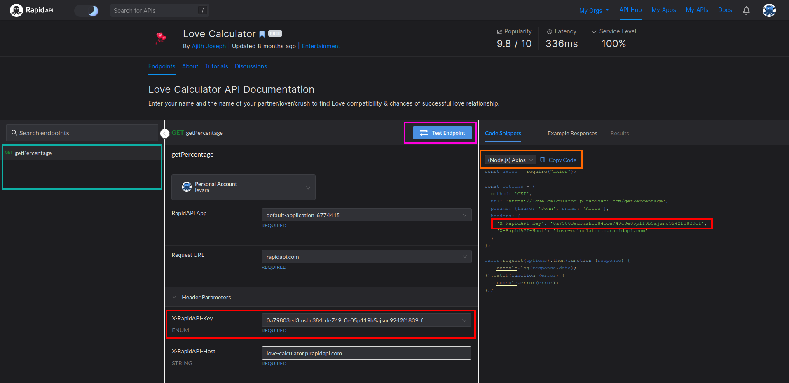

# Lab 3 - CLI Chat Assistant
## Python classes, APIs and modular program design

Billy is command-line interface (CLI) chatbot assistant. He responds to
different commands and provides responses to those commands. Additionally,
Billy is very extensible and easily upgradeable. At the moment, he knows how to
roll a dice (or multiple dices) for you, tell you a joke or tell you a fun
fact. However, you can teach him to be so much more.

Billy lives at [this Gitlab repo](https://gitlab.com/levara/se-chat-assistant).
You can see Billy's evolution through his [commit history](https://gitlab.com/levara/se-chat-assistant/-/commits/master).
In the beginning, all the functionality was placed inside the `ui.py` file. As
the program grew, we slowly extracted the functionalities to different classes:

- At first, we extracted all the functionalities regarding jokes to its own
  class `JokeHandler` 
  (see [the commit](https://gitlab.com/levara/se-chat-assistant/-/commit/105d0370551d7f7f23801e7b7645e130971219c5) )
- Next, we extracted all the functionalities regarding facts to its own class
  `FactHandler`
  (see [the commit](https://gitlab.com/levara/se-chat-assistant/-/commit/db7ce04549caf4df570c59f3dd2ac742b600de65) )
- Next, we extracted all the dice rolling logic to its own class `DiceHandler`
  (see [the commit](https://gitlab.com/levara/se-chat-assistant/-/commit/569aea05694114452b518498e35914389aca5486) )

Still, at this point Billy wasn't that extensible. The main UI class still had
to know a lot about different handlers that Billy had. All the parsing was
still done in the main UI class. We decided that the code would be a lot more
extensible and modular if we extracted all the input parsing logic into a
different class. Thus, we created the `QueryParser` class which should be
responsible for parsing the input (queries the user types) and invoking a
correct handler for that type of input. 

First, we created the `QueryParser` class ([the commit](https://gitlab.com/levara/se-chat-assistant/-/commit/9bafa2b351362a6f9754c6a985ff153e44a589b2)), 
performed a simple test to see if all the handlers are visible from the scope
of a UI class, and then we implemented the `QueryParser` to take the query as
an input and return the appropriate handler to the `UI` class
([the commit](https://gitlab.com/levara/se-chat-assistant/-/commit/e6b22dfa74af54d84318a0c9652370c4afd99cc8)).

The `main_loop` method in the `UI` class now looks like this:

```python
def main_loop(self):
    parser = QueryParser(self)
    while True:
        query = self.ask()
        handler = parser.get_query_handler(query)
        handler.process(query)
```

The `QueryParser` now implements a method `get_query_handler` which will return
an appropriate handler for that query. 
Still, the `QueryParser` has to know about all the different inputs that the
chatbot can process, which is still suboptimal. 

We would like to extract that responsibility from the `QueryParser` class.
Instead of `QueryParser` having to know every possible command for every
possible handler, we will let each handler decide if the query was meant for
them. Thus, each handler will get a new public method `can_process_query`
which will simply return true if the handler knows how to process that query,
or false if the handler does not
([the commit](https://gitlab.com/levara/se-chat-assistant/-/commit/b7acf52a2674bc1dd4b730d2a2a96cef609577fb)).

Finally, we can add a template file for a new handler, with the public interface methods 
prepared and commented, so you can easily implement new handlers and teach
Billy to do other cool stuff 
([the commit](https://gitlab.com/levara/se-chat-assistant/-/commit/16b07629d478a7ae2c0d392f479c658f081175af)).

## Interactive exercises

### Exercise 1 - add code to our repo

Let's add the code for Billy to our own repos. Go to `lab3` directory inside
your repository, clone Billy's repo, and enter that repository:

```
cd lab3
git clone https://gitlab.com/levara/se-chat-assistant.git
cd se-chat-assistant
```

Try running the chatbot by going to `lab3/se-chat-assistant` in terminal and
running `python assistant.py`.

After you cloned Billy's repo inside your own repository, 
any git command will now reference Billy's repository, since git stops
searching for a repo root once it finds a `.git` directory. Try running 
`git log` and looking at recent commits.

Now we have a
situation where we have a git repository inside a git repository. Let's solve
this by deleting the Billy's `.git` directory, either in the File Explorer in
Windows, or through the terminal:

```
cd lab3/se-chat-assistant
rm -rf .git
```

Running `git status` now will show all Billy's files as added to your own
repository. Add the whole `se-chat-assistant` to git and commit it.

### Exercise 2 - teach Billy to play rock-paper-scissors

Take a look at [this commit](https://gitlab.com/levara/se-chat-assistant/-/commit/2c3f770dde8a344b2c7d5b1c5aca7358fa46f0ab).
All you have to do to add a new handler is:

- Copy `new_handler_template.py` to a new file (in this case `rps_handler.py`).
- Rename the class in the copied file to `RockPaperScissorsHandler`.
- Implement `can_process_query` and `process` methods for the new handler.
- Import and register the new handler class inside `QueryParser`.

### Exercise 3 - teach Billy how to do API calls to remote services

For this exercise you will need a rapidapi.com account. Take a look at 
[this commit](https://gitlab.com/levara/se-chat-assistant/-/commit/df6ceb68e0f404e77b3af1e0fc579bac8da5374a).

This handler has an additional method called `call_api` which calls the API,
gets the JSON response from the API, converts it to a dictionary (`json.loads`)
and returns the dictionary. The `process()` method then prints to the UI the
scores that the API returned to you.

Take a look at the Love Calculator API. Go to rapidapi.com, login with your
user details, and then open the [Love Calculator API page](https://rapidapi.com/ajith/api/love-calculator/).
The page should look something like this:



- Red rectangle shows your API key, which identifies you to the rapidapi.com web
  service, so your first task is to change the key in 
  [this line in LoveHandler](https://gitlab.com/levara/se-chat-assistant/-/blob/df6ceb68e0f404e77b3af1e0fc579bac8da5374a/love_handler.py#L35)
  to the one that rapidapi.com shows to you. The requests to the API are rate
  limited.

- Orange rectangle enables you to choose an example code for any language. Here
  you can choose: `Python -> Requests`, which will give you a code that you can
  run locally from your computer in order to test out the API. Try copying the
  code into a new python file and running that code.

- Magenta rectangle shows a button that you can click, which will execute the
  Code Snippet and fire a request towards the API. This way you can easily
  chech if the API works and what type of response it gives you.

- Cyan rectangle shows additional methods that the API can respond to. Clicking
  on any of the shows the example code and the configuration in the middle and
  right panes.

**Implement the code from the commit at the beginning of the exercise, but set
it to use your own API key.**

## Your own work

### Teach Billy to respond to four more commands

- Choose 4 more APIs and write handlers for those APIs.

Hint: When choosing and API, look for those that are either free (like Love
Calculator), or that have a hard limit on free tier on pricing page. 

For example: 
- [VACCOVID](https://rapidapi.com/vaccovidlive-vaccovidlive-default/api/vaccovid-coronavirus-vaccine-and-treatment-tracker/) API is completely free.
- [Genius - Song Lyrics](https://rapidapi.com/Glavier/api/genius-song-lyrics1/pricing) API has a 
  pricing tab, which means the API is not free. You can subscribe to the lowest
  (Basic) plan since it has a hard limit of 100 requests per month.
- [Dark Sky](https://rapidapi.com/darkskyapis/api/dark-sky/) Weather API does
  not have a hard limit on the number of requests. Their free tier has a number
  of free requests per month, but they also have a charge when requests exceed
  the free limits. APIs which do not have hard limits will require credit card
  details before allowing you to subscribe to the API. So, if you do not want
  to give your credit card details, choose to subscribe to an API that **does**
  have hard limits.


